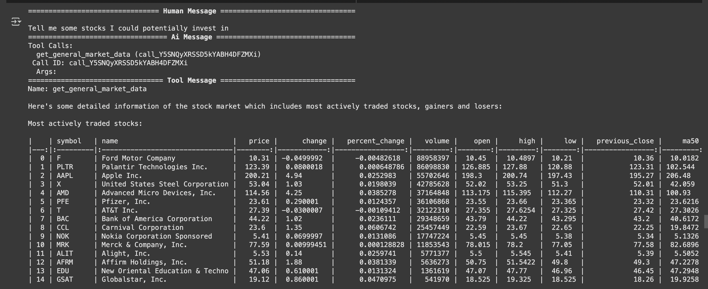
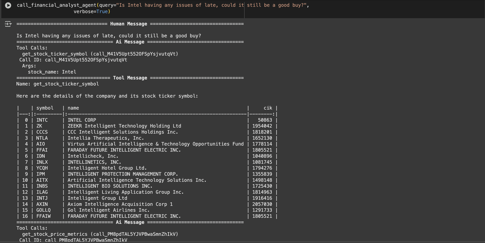

# 📊 Financial Analyst Agent using LangChain, OpenBB & OpenAI

This project helped me **learn and implement a ReAct (Reasoning + Acting) agent** for financial data analysis using **LangChain**, **OpenAI GPT**, and **OpenBB**. The agent can interact with stock market data, reason about financial queries, and fetch actionable insights by calling tools dynamically.

---

## 🚀 What I Learned

- ✅ How to build an **agentic system** using the ReAct framework (Reasoning + Action loop)
- ✅ How to register and implement **LangChain Tools** for tasks like stock price analysis, company lookup, and news retrieval
- ✅ How to integrate **OpenBB SDK** to fetch real-time financial data (e.g., P/E ratio, news, price history)
- ✅ How to combine **LLM reasoning with tool-based actions** for dynamic responses
- ✅ How to orchestrate tool calls and prompt flows using **LangGraph**

---

## 🧠 Tech Stack

- **LangChain** – Agent framework for reasoning and tool usage  
- **OpenAI GPT-3.5/4** – For natural language understanding and decision making  
- **OpenBB SDK** – To fetch stock prices, company financials, and news  
- **LangGraph** – To structure the ReAct loop logic  
- **Python**, **yFinance** – For additional market data access

---

## 🏗️ Features Implemented

- `GET_STOCK_TICKER`: Get stock symbol and details by company name  
- `GET_STOCK_PRICE_METRICS`: Retrieve quote and historical performance  
- `GET_STOCK_NEWS`: Summarize recent news headlines about a stock  
- `GET_FUNDAMENTAL_INDICATORS`: Fetch P/E ratio, ROE, etc.  
- `GET_GENERAL_MARKET_DATA`: Analyze broader market trends

---

## 🔐 Setup Instructions

### 1. Clone the Repo
```bash
git clone https://github.com/yourusername/financial-analyst-agent.git
cd financial-analyst-agent
```

### 2. Install Required Packages
```bash
pip install langchain==0.3.14
pip install langchain-openai==0.3.0
pip install langchain-community==0.3.14
pip install langgraph==0.2.66
pip install yfinance==0.2.51
pip install openbb[all]
```

### 3. Configure Keys
You'll be prompted to enter:
- **OpenAI API Key**
- **OpenBB Personal Access Token (PAT)**

These are stored as environment variables securely.

---

## ▶️ Run the Agent
```bash
python financial_analyst_agent.py
```

You can now ask the agent:
- “What’s the current price of Apple?”
- “Give me the latest news about Nvidia”
- “What’s the P/E ratio for Google?”

---

## 🧩 Next Steps

- [ ] Add a conversational UI using Streamlit  
- [ ] Store user session history for memory  
- [ ] Expand the toolset to cover cryptocurrencies, ETFs, and more

---

## 📚 Resources I Used

- [LangChain Docs](https://docs.langchain.com/)  
- [OpenBB SDK Docs](https://docs.openbb.co/platform/reference)  
- [ReAct Prompt Paper](https://arxiv.org/abs/2210.03629)  
- [OpenAI API Reference](https://platform.openai.com/docs)

## 🧠 Agent in Action

Below are some examples of how the agent responds to various financial queries using the ReAct framework:

### 🔎 Example 1: Potiental investments


### 🔎 Example 1: Whether do I Invest in this company or not?

